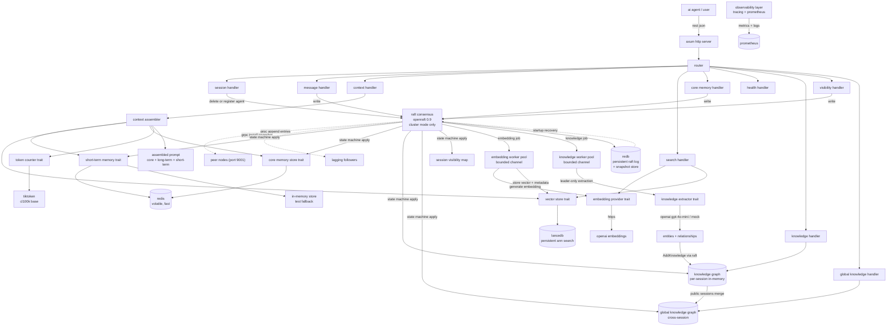

# Engram

An asynchronous semantic memory backend for LLM agents, written in Rust.

[](LICENSE)
[](https://www.rust-lang.org/)

## overview

Engram is a backend service for LLM agents. It stores three types of memory: short-term (recent messages), long-term (semantic vector search), and core memory (pinned facts). The goal is to give agents a transparent, efficient, and controllable way to manage context.

Engram is written in Rust for performance and reliability. It exposes all operations via a REST API and gives you full control over token budgets and context assembly.

Engram is built for developers who want to plug in their own LLM agents, run locally or in production, and see exactly what goes into the context window. All memory operations are behind trait abstractions, so you can swap implementations or mock them in tests without changing any calling code.

With the latest update, Engram also supports collective memory: multiple agents can share a global knowledge graph, sessions can be marked public or private, and conflicting facts across sessions are surfaced via a dedicated endpoint.

## architecture



## quickstart (local)

### prerequisites
- Rust (1.92 or newer)
- Docker (for Redis)
- OpenAI API key

### clone and build
```sh
git clone https://github.com/bit2swaz/engram.git
cd engram
cargo build --release
```

### start Redis
```sh
docker run -d --name engram-redis -p 6379:6379 redis:7-alpine
```

### set environment variables
copy `.env.example` to `.env` and fill in your openai api key, or set them manually:
```sh
export OPENAI_API_KEY=sk-your-key-here
export REDIS_URL=redis://localhost:6379
```

### run the server
```sh
cargo run
```

### example curl commands
create a session:
```sh
curl -X POST http://localhost:3000/sessions
```
create a session and register an agent:
```sh
curl -X POST http://localhost:3000/sessions \
  -H 'content-type: application/json' \
  -d '{"agent_id":"agent-42"}'
```
add a message:
```sh
curl -X POST http://localhost:3000/sessions/{session_id}/messages \
  -H 'content-type: application/json' \
  -d '{"role":"user","content":"hello, what is rust?"}'
```
get context:
```sh
curl http://localhost:3000/sessions/{session_id}/context
```
search:
```sh
curl -X POST http://localhost:3000/sessions/{session_id}/search \
  -H 'content-type: application/json' \
  -d '{"query":"rust async","top_k":5}'
```
add core memory:
```sh
curl -X PUT http://localhost:3000/sessions/{session_id}/core-memory \
  -H 'content-type: application/json' \
  -d '{"fact":"user prefers dark mode"}'
```
make a session public so it contributes to the global knowledge graph:
```sh
curl -X PUT http://localhost:3000/sessions/{session_id}/visibility \
  -H 'content-type: application/json' \
  -d '{"visibility":"Shared"}'
```
query the global knowledge graph:
```sh
curl http://localhost:3000/knowledge/global
```
delete session:
```sh
curl -X DELETE http://localhost:3000/sessions/{session_id}
```

## quickstart (Docker)

- copy `.env.example` to `.env` and fill in your openai api key
- run:
```sh
docker compose up -d
```
- wait for the health check to pass on `http://127.0.0.1:${ENGRAM_HOST_PORT:-3002}/health`
- use the same curl examples above, but target `http://127.0.0.1:${ENGRAM_HOST_PORT:-3002}` for the Compose deployment

## API overview

| method | path                                                          | description                                  |
|--------|---------------------------------------------------------------|----------------------------------------------|
| GET    | /health                                                       | health check                                 |
| GET    | /metrics                                                      | Prometheus metrics                           |
| GET    | /api-docs/openapi.json                                        | OpenAPI specification                        |
| GET    | /swagger-ui/                                                  | Swagger UI                                   |
| POST   | /sessions                                                     | create session (optional agent_id body)      |
| POST   | /sessions/{session_id}/messages                               | add message                                  |
| GET    | /sessions/{session_id}/context                                | get assembled context                        |
| POST   | /sessions/{session_id}/search                                 | semantic search                              |
| PUT    | /sessions/{session_id}/core-memory                            | add core memory fact                         |
| PUT    | /sessions/{session_id}/visibility                             | set session visibility (Private/Shared)      |
| DELETE | /sessions/{session_id}                                        | delete session                               |
| GET    | /sessions/{session_id}/knowledge                              | get knowledge graph (entities + edges)       |
| GET    | /sessions/{session_id}/knowledge/entities/{entity_name}       | get related entities for a given entity      |
| GET    | /sessions/{session_id}/knowledge/path?from=X&to=Y             | find shortest path between two entities      |
| GET    | /sessions/{session_id}/knowledge/export?format=json\|dot      | export knowledge graph (JSON or Graphviz)    |
| GET    | /knowledge/global                                             | get cross-session global knowledge graph     |
| GET    | /knowledge/global/entities/{name}                             | get related entities in global graph         |
| GET    | /knowledge/global/entities/{name}/sources                     | get sessions that contributed this entity    |
| GET    | /knowledge/global/path?from=X&to=Y                            | find path in global graph                    |
| GET    | /knowledge/global/export?format=json\|dot                     | export global graph                          |
| GET    | /knowledge/global/conflicts                                   | list conflicting facts across sessions       |
| GET    | /cluster                                                      | cluster status (cluster mode only)           |
| POST   | /cluster/init                                                 | initialize cluster                           |
| POST   | /cluster/add-learner                                          | add a learner node                           |
| POST   | /cluster/change-membership                                    | promote learners to full members             |

see [API.md](docs/API.md) for full details.

## configuration

the application reads configuration from environment variables:

| variable                   | description                                             | default                  |
|----------------------------|---------------------------------------------------------|--------------------------|
| REDIS_URL                  | Redis connection url                                    | redis://localhost:6379   |
| OPENAI_API_KEY             | OpenAI API key                                          | required (unless mock)   |
| OPENAI_BASE_URL            | optional OpenAI-compatible API base URL                 | unset                    |
| LANCE_DB_PATH              | LanceDB data path                                       | ./data/lancedb           |
| LANCEDB_PATH               | legacy alias for `LANCE_DB_PATH`                        | unset                    |
| EMBEDDING_DIMENSION        | embedding vector width                                  | 1536                     |
| SHORT_TERM_COUNT           | number of recent messages to keep                       | 20                       |
| EMBEDDING_MAX_CONCURRENCY  | number of embedding workers                             | 10                       |
| MPSC_CHANNEL_SIZE          | embedding job queue size                                | 1000                     |
| KNOWLEDGE_EXTRACTOR        | knowledge extractor backend (`openai` or `mock`)        | openai                   |
| KNOWLEDGE_MAX_WORKERS      | number of knowledge extraction workers                  | 4                        |
| KNOWLEDGE_CHANNEL_SIZE     | knowledge job queue size                                | 500                      |
| RUST_LOG                   | tracing log filter                                      | info                     |
| LOG_FORMAT                 | logging format (`pretty` or `json`)                     | pretty                   |

**cluster mode** (requires all of the below):

| variable              | description                                                              | example                           |
|-----------------------|--------------------------------------------------------------------------|-----------------------------------|
| NODE_ID               | unique integer node identifier                                           | `1`                               |
| RAFT_ADDR             | bind address for the gRPC Raft server                                    | `0.0.0.0:9001`                    |
| RAFT_ADVERTISE_ADDR   | address other nodes route to (required when binding 0.0.0.0)            | `node-1:9001`                     |
| CLUSTER_PEERS         | comma-separated gRPC peers as `id:host:port`                             | `2:node-2:9001,3:node-3:9001`     |
| CLUSTER_HTTP_PEERS    | comma-separated HTTP peers as `id:host:port` (for leader redirect URLs)  | `2:node-2:3000,3:node-3:3000`     |
| RAFT_DB_PATH          | path to the redb file for the persistent Raft log and snapshot store     | `./data/raft/engram.redb`         |
| SNAPSHOT_LOG_THRESHOLD| number of committed log entries after which the leader compacts the log  | `1000`                            |

values like `similarity_threshold` and `max_tokens` are controlled per request through query parameters on the context endpoint.

## features

- short-term memory (recent messages via Redis)
- long-term semantic search (LanceDB vector store)
- core memory (pinned facts)
- context assembly with token budgeting
- pair-preserving trim for dialogue
- background embedding worker (bounded channel, configurable concurrency)
- idempotent message ingestion
- knowledge graph extraction (entities + relationships via OpenAI GPT-4o-mini or mock)
- per-session knowledge graph with BFS path-finding, persisted via snapshots
- leader-only extraction with Raft-replicated `AddKnowledge` command (all nodes stay consistent)
- knowledge graph export (JSON and Graphviz DOT)
- session visibility control (Private/Shared) via `SetSessionVisibility` Raft command
- global cross-session knowledge graph: public sessions contribute their entities and relationships to a shared graph
- agent registration: sessions can be associated with a named agent at creation time
- conflict detection: the global graph tracks conflicting relationship types across sessions
- Prometheus metrics endpoint (includes knowledge, snapshot, and global graph metrics)
- Raft consensus for fault-tolerant distributed writes (OpenRaft 0.9)
- gRPC inter-node transport for Raft (Vote, AppendEntries, and InstallSnapshot via tonic 0.12)
- follower-to-leader HTTP redirect (307) in cluster mode
- per-node LanceDB with eventual consistency via deterministic embeddings
- persistent redb-backed Raft log and snapshot store (survives restarts)
- full state machine snapshots covering short-term memory, core memory, knowledge graph, global graph, session visibility, and agent registry
- startup recovery from the latest snapshot followed by Raft log replay
- InstallSnapshot RPC so lagging followers catch up without manual re-initialization
- automatic log compaction after every `SNAPSHOT_LOG_THRESHOLD` committed entries
- cluster management REST API
- OpenAPI docs and Swagger UI
- LongMemEval and BEAM benchmark harnesses

## quickstart (3-node cluster)

the cluster compose file runs three Engram nodes, each with its own Redis instance, connected over a shared Docker network.

```sh
# copy and fill in your OpenAI key
cp .env.example .env

# build and start the cluster
docker compose -f docker-compose.cluster.yml up -d --build

# wait for all nodes to be healthy, then initialize the cluster
./scripts/cluster-init.sh

# verify all acceptance criteria
./scripts/cluster-verify.sh
```

the verify script checks 17 criteria: leader election, write replication to all nodes, 307 redirect from followers, failover, Prometheus metric presence, knowledge graph replication, delete-session cleanup, node restart and recovery from the Raft log, snapshot compaction, restart-then-verify that state is fully restored from the latest snapshot, session visibility propagation, global graph population from public sessions, agent registration, global entity and relationship count metrics, global entity queries, global conflict detection, and global graph snapshot round-trip. it exits 0 only if all criteria pass.

see `docker-compose.cluster.yml` and the scripts in `scripts/` for details.

## quality benchmarking

the repository includes a retrieval-quality harness for LongMemEval and BEAM under `benchmarks/`.

- LongMemEval uses `benchmarks/longmemeval_engram.py` and emits retrieval summaries plus `hypothesis.jsonl` for the official evaluator.
- BEAM uses `benchmarks/beam_engram.py` and supports flat JSON input as well as the repository-style `chats/100K`, `chats/500K`, and `chats/1M` layouts.
- `scripts/run_quality_benchmarks.sh` defaults to `http://127.0.0.1:3002` and is meant to target the Docker Compose deployment to avoid common port `3000` conflicts.
- Retrieval smoke runs can avoid hosted embedding APIs entirely by letting the harness start `tools/local_embed_server.py` and a matching Engram process with `--start-local-embed-server --start-engram`.
- Preliminary LongMemEval retrieval results are now published: a 5-question local-embedder slice reached perfect recall@5/10. See `BENCHMARKS.md`.

see [docs/QUALITY_BENCHMARKS.md](docs/QUALITY_BENCHMARKS.md) for the end-to-end runbook.

## documentation

- [API.md](docs/API.md)
- [ARCHITECTURE.md](docs/ARCHITECTURE.md)
- [BENCHMARKS.md](BENCHMARKS.md)
- [QUALITY_BENCHMARKS.md](docs/QUALITY_BENCHMARKS.md)
- [COMPARISON.md](docs/COMPARISON.md)
- [CONTRIBUTING.md](CONTRIBUTING.md)
- [SSOT.md](docs/SSOT.md)

## license

MIT license. see [LICENSE](LICENSE) for details.
