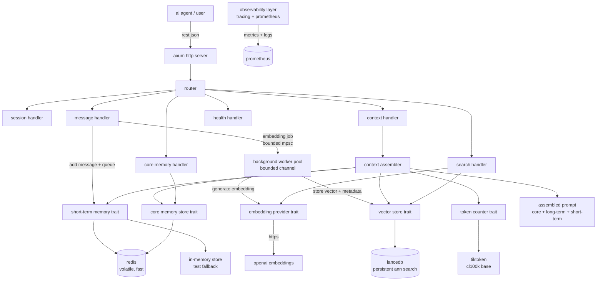

# engram

An asynchronous semantic memory backend for LLM agents, written in Rust.

[](LICENSE)
[](https://www.rust-lang.org/)

## overview

engram is a backend service for large language model (LLM) agents. it provides three types of memory: short-term (recent messages), long-term (semantic vector search), and core memory (pinned facts). the goal is to give LLM agents a transparent, efficient, and controllable way to manage context and recall information.

engram is written in rust for performance and reliability. it is designed for transparency, with full control over token budgets and context assembly, and exposes all operations via a simple REST API.

engram is built for developers who want to plug in their own LLM agents, run locally or in production, and have full visibility into how memory is managed. it is easy to run, test, and extend. all memory operations are behind trait abstractions, making it easy to swap implementations or mock for tests.

## architecture



## quickstart (local)

### prerequisites
- Rust (1.92 or newer)
- Docker (for Redis)
- OpenAI API key

### clone and build
```sh
git clone https://github.com/bit2swaz/engram.git
cd engram
cargo build --release
```

### start Redis
```sh
docker run -d --name engram-redis -p 6379:6379 redis:7-alpine
```

### set environment variables
copy `.env.example` to `.env` and fill in your openai api key, or set them manually:
```sh
export OPENAI_API_KEY=sk-your-key-here
export REDIS_URL=redis://localhost:6379
```

### run the server
```sh
cargo run
```

### example curl commands
create a session:
```sh
curl -X POST http://localhost:3000/sessions
```
add a message:
```sh
curl -X POST http://localhost:3000/sessions/{session_id}/messages \
  -H 'content-type: application/json' \
  -d '{"role":"user","content":"hello, what is rust?"}'
```
get context:
```sh
curl http://localhost:3000/sessions/{session_id}/context
```
search:
```sh
curl -X POST http://localhost:3000/sessions/{session_id}/search \
  -H 'content-type: application/json' \
  -d '{"query":"rust async","top_k":5}'
```
add core memory:
```sh
curl -X PUT http://localhost:3000/sessions/{session_id}/core-memory \
  -H 'content-type: application/json' \
  -d '{"fact":"user prefers dark mode"}'
```
delete session:
```sh
curl -X DELETE http://localhost:3000/sessions/{session_id}
```

## quickstart (Docker)

- copy `.env.example` to `.env` and fill in your openai api key
- run:
```sh
docker compose up -d
```
- wait for the health check to pass
- use the same curl examples above (replace `localhost:3000` if needed)

## API overview

| method | path                                 | description                       |
|--------|--------------------------------------|-----------------------------------|
| GET    | /health                              | health check                      |
| GET    | /metrics                             | Prometheus metrics                |
| GET    | /api-docs/openapi.json               | OpenAPI specification             |
| GET    | /swagger-ui/                         | Swagger UI                        |
| POST   | /sessions                            | create session                    |
| POST   | /sessions/{session_id}/messages      | add message                       |
| GET    | /sessions/{session_id}/context       | get assembled context             |
| POST   | /sessions/{session_id}/search        | semantic search                   |
| PUT    | /sessions/{session_id}/core-memory   | add core memory fact              |
| DELETE | /sessions/{session_id}               | delete session                    |

see [API.md](docs/API.md) for full details.

## configuration

the application currently reads these environment variables directly:

| variable                | description                              | default                  |
|-------------------------|------------------------------------------|--------------------------|
| REDIS_URL               | Redis connection url                     | redis://localhost:6379   |
| OPENAI_API_KEY          | OpenAI API key                           | required                 |
| LANCE_DB_PATH           | LanceDB data path                        | ./data/lancedb           |
| LANCEDB_PATH            | legacy alias for `LANCE_DB_PATH`         | unset                    |
| SHORT_TERM_COUNT        | number of recent messages to keep        | 20                       |
| EMBEDDING_MAX_CONCURRENCY | number of embedding workers            | 10                       |
| MPSC_CHANNEL_SIZE       | embedding job queue size                 | 1000                     |
| RUST_LOG                | tracing log filter                       | info                     |
| LOG_FORMAT              | logging format (`pretty` or `json`)      | pretty                   |

values like `similarity_threshold` and `max_tokens` are currently controlled per request through query parameters on the context endpoint rather than startup environment variables.

## features

- short-term memory (recent messages)
- long-term semantic search (vector store)
- core memory (pinned facts)
- context assembly with token budgeting
- pair-preserving trim for dialogue
- background embedding worker
- idempotency for message ingestion
- Prometheus metrics endpoint
- OpenAPI docs and Swagger UI
- generated benchmark report
- optional authentication (future)

## documentation

- [API.md](docs/API.md)
- [ARCHITECTURE.md](docs/ARCHITECTURE.md)
- [BENCHMARKS.md](BENCHMARKS.md)
- [COMPARISON.md](docs/COMPARISON.md)
- [CONTRIBUTING.md](CONTRIBUTING.md)
- [SSOT.md](docs/SSOT.md)

## license

MIT license. see [LICENSE](LICENSE) for details.
