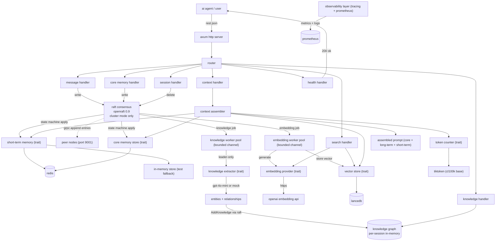
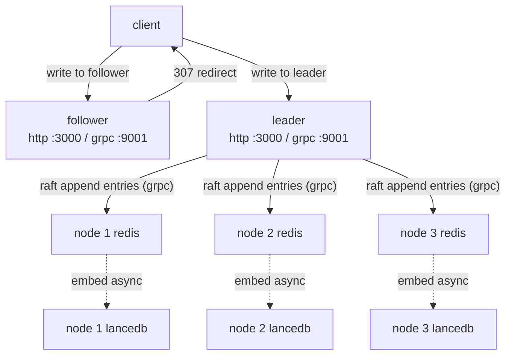

# Architecture

## Overview

engram is an asynchronous semantic memory backend for LLM-powered agents, written in Rust. It provides short-term, long-term, and core memory for agents, enabling context assembly with strict token budgeting, semantic search, and transparent memory management.

The system is designed for performance, reliability, and developer control, with all major components behind trait abstractions for easy swapping and testing.

## Data flow

in cluster mode, writes go through Raft consensus before reaching the stores. in standalone mode (NODE_ID not set), the Raft layer is absent and write handlers reach the stores directly.

reads (context, search) always go directly to the local stores on whichever node receives the request.

## Core abstractions (traits)

All major components are behind trait abstractions, which lets implementations be swapped out and mocked in tests without changing any calling code.

`EmbeddingProvider` generates text embeddings. In production this calls OpenAI; in tests it returns deterministic fixed vectors.

`VectorStore` handles long-term memory storage and semantic search. The production implementation is LanceDB.

`ShortTermMemory` manages recent message storage, count-based trimming, and embedding status tracking. Redis and in-memory implementations are both available.

`TokenCounter` counts tokens in text. The production implementation uses `tiktoken-rs` with `cl100k_base`.

`CoreMemoryStore` manages pinned session facts. Redis and in-memory implementations are both available.

`KnowledgeExtractor` extracts named entities and typed relationships from text. The `OpenAIKnowledgeExtractor` calls GPT-4o-mini with a structured JSON prompt and exponential backoff on 429s. `MockKnowledgeExtractor` uses pattern matching against a fixed set of relationship phrases; this is the default in Docker Compose and CI to avoid OpenAI quota consumption.

## Design decisions

| decision | alternatives | final choice & rationale |
|----------|-------------|-------------------------|
| bounded mpsc channel + worker pool for embedding | unbounded channel, inline embedding | bounded channel prevents memory blowup, and a fixed worker pool caps concurrent API calls while keeping request latency low |
| LanceDB over Milvus | Milvus, Pinecone, QDrant | LanceDB is embedded, zero-ops, Rust-native, easy to test and deploy |
| Redis for short-term/core memory | in-memory only, Postgres | Redis is fast, supports TTL, and is widely used for volatile state |
| pair-preserving trim in context assembler | naive trim, no trim | preserves dialogue integrity, prevents LLM hallucinations |
| idempotent embedding jobs | no idempotency | safe retries, prevents duplicate vectors on crash or retry |
| observability from day 1 | add later | tracing and Prometheus from the start for reliability and debugging |
| leader-only extraction for knowledge | all nodes extract | one LLM call per message vs N (one per node); non-determinism in extraction would cause divergent graphs across nodes |
| AddKnowledge routed through Raft | apply directly on leader | ensures all nodes receive the same extraction result; graph stays consistent without extra sync |
| in-memory knowledge graph per session | persistent DB | Stage 2 scope; fast, simple, no operational overhead; per-session isolation maps naturally to HashMap |
| MockKnowledgeExtractor as default in Docker Compose | always OpenAI | decouples cluster verification from OpenAI API quota; pattern-matching mock is deterministic and offline-capable |

## Context assembly algorithm

- allocate token budget: start with core memory (non-trimmable), then trim short-term messages to fit the remaining budget, then inject long-term memories if space remains
- derive query: use the most recent user message in trimmed short-term, else the last message, else empty
- perform semantic search: embed the query, search LanceDB, filter by similarity threshold, and take top-k
- format: each long-term memory as `Memory: {text}`
- assemble: core memory, long-term memories, then short-term messages

## Security and multi-tenancy

- current: no server-side authentication in the MVP; `OPENAI_API_KEY` is only used for outbound embedding requests
- future: API key authentication, multi-tenant support, and optional auth are planned for production

## Deployment architecture

Docker compose sets up:
- Redis: short-term and core memory
- app: Rust server, reads env vars from `.env`
- Prometheus: metrics scraping
- Grafana: dashboard (optional)

the application reads configuration from environment variables such as `REDIS_URL`, `OPENAI_API_KEY`, `LANCE_DB_PATH`, `SHORT_TERM_COUNT`, `EMBEDDING_MAX_CONCURRENCY`, `MPSC_CHANNEL_SIZE`, `RUST_LOG`, and `LOG_FORMAT`.

## Stage 2: Knowledge Formation

Stage 2 adds a knowledge graph pipeline that runs alongside the existing memory system. Every message that flows through the Raft state machine also produces a `KnowledgeJob` which is forwarded to a dedicated worker pool.

### Knowledge pipeline

1. State machine receives `AddMessage` command → enqueues `KnowledgeJob { session_id, message_id, text }` on a bounded channel (capacity 500 by default).
2. Knowledge workers dequeue jobs. In cluster mode only the **current leader** calls the extractor; followers skip because they will receive the result via Raft replication. This prevents duplicate LLM calls and avoids non-deterministic divergence between nodes.
3. The extractor calls GPT-4o-mini (or the mock) with a structured JSON prompt requesting named entities and typed relationships.
4. The result is submitted as a `MemoryCommand::AddKnowledge` through `raft.client_write()`. OpenRaft replicates this to all nodes.
5. Each node's state machine applies `AddKnowledge` to its local `KnowledgeGraph` (idempotent by `(session_id, message_id)` key).

In standalone mode (no `NODE_ID`) the worker applies the extraction result directly to the local graph without going through Raft.

### KnowledgeGraph internals

`KnowledgeGraph` is a per-session directed graph backed by [`petgraph`](https://docs.rs/petgraph). Each session has its own `DiGraph<EntityNode, RelEdge>` plus a `HashMap<String, NodeIndex>` for O(1) name lookups. Deduplication is tracked in a `HashSet<String>` keyed on `"session_id\x00message_id"`.

Key operations:
- `apply_extraction` — upserts entities and adds edges; returns `false` if the `(session_id, message_id)` pair was already processed.
- `get_related` — returns all neighbours (incoming and outgoing) for a named entity.
- `find_path` — BFS shortest path following outgoing edges only; returns a `Vec<PathEdge>` or `None`.
- `delete_session` — removes the session graph and all its dedup keys.

### Knowledge REST endpoints

| method | path | description |
|--------|------|-------------|
| GET | `/sessions/{id}/knowledge` | full graph: all entities and edges for the session |
| GET | `/sessions/{id}/knowledge/entities/{entity}` | all entities connected to the named entity (incoming + outgoing) |
| GET | `/sessions/{id}/knowledge/path?from=X&to=Y` | BFS shortest path between two named entities |
| GET | `/sessions/{id}/knowledge/export?format=json\|dot` | export the graph as JSON or Graphviz DOT |

### Knowledge metrics

Four new Prometheus metrics are exposed alongside the existing Raft and embedding metrics:

| metric | type | description |
|--------|------|-------------|
| `engram_knowledge_extraction_duration_seconds` | histogram | wall-clock time per extraction call (label: `extractor`) |
| `engram_knowledge_entities_extracted_total` | counter | cumulative entities extracted |
| `engram_knowledge_relationships_extracted_total` | counter | cumulative relationships extracted |
| `engram_knowledge_queue_size` | gauge | pending jobs in the knowledge channel |

## Distributed cluster mode (Stage 1)

In cluster mode, multiple engram nodes form a Raft consensus group using [OpenRaft 0.9](https://github.com/datafuselabs/openraft). Cluster mode is enabled by setting `NODE_ID` in the environment. Without it, the server runs in standalone mode exactly as described above.

### Node anatomy

Each cluster node runs two servers simultaneously:

- an Axum HTTP server (default port 3000) that handles client requests
- a tonic gRPC server (default port 9001) that handles Raft protocol messages (Vote, AppendEntries)

Each node also owns its own Redis instance and LanceDB database. There is no shared storage between nodes.

### Write path

In cluster mode, every write goes through Raft before a response is returned:

1. Client sends a write (add message, add fact, or delete session) to any node
2. If the receiving node is a follower, it returns HTTP 307 with a `Location` header pointing to the leader's HTTP address
3. If the receiving node is the leader, it calls `raft.client_write()` with a `MemoryCommand`
4. OpenRaft replicates the command to a quorum of nodes via gRPC AppendEntries
5. Each node's Raft state machine applies the committed command to its local Redis

The cluster also exposes management endpoints at `/cluster`, `/cluster/init`, `/cluster/add-learner`, and `/cluster/change-membership`.

### LanceDB consistency

LanceDB is per-node and eventually consistent. When a write is committed through Raft, each node's state machine enqueues an `EmbeddingJob`. Each node's background worker independently calls OpenAI and stores the result in its local LanceDB.

OpenAI text embeddings are deterministic for the same input. All nodes converge to identical vector state, with a timing lag proportional to embedding worker throughput. Semantic search results may be briefly stale on followers. This is a deliberate Stage 1 tradeoff: replicating 1536-float vectors through Raft on every write would be wasteful.

### Raft implementation

| component | description |
|-----------|-------------|
| `EngRaftLogStore` | in-memory BTreeMap log store, implements `RaftLogStorage + RaftLogReader` |
| `EngStateMachineStore` | applies committed `MemoryCommand` entries to Redis and the `KnowledgeGraph`; snapshot methods return `Unsupported` |
| `EngRaftNetwork` | factory that creates per-peer gRPC connections using tonic channels |
| `EngRaftNetworkConnection` | sends Vote and AppendEntries RPCs; `send_install_snapshot` returns `Unreachable` |
| `RaftGrpcServer` | tonic service implementation that forwards incoming Raft RPCs to the local `RaftHandle` |

`MemoryCommand` has four variants: `AddMessage`, `AddFact`, `DeleteSession`, and `AddKnowledge`. `AddMessage` now also enqueues a `KnowledgeJob` so every committed message is a candidate for knowledge extraction.

The log store is in-memory. It does not survive restarts. Stage 2 will replace it with a persistent store (sled or RocksDB).

### Prometheus metrics in cluster mode

Four additional metrics are exported when a node is in cluster mode:

| metric | type | description |
|--------|------|-------------|
| `engram_raft_term` | gauge | current Raft term |
| `engram_raft_commit_index` | gauge | index of the last applied log entry |
| `engram_raft_is_leader` | gauge | 1 if this node is the current leader, 0 otherwise |
| `engram_raft_leader_changes_total` | counter | number of leader changes observed by this node |

A background task watches the OpenRaft metrics channel and updates these gauges on every change.

### Knowledge metrics (all modes)

Four additional metrics cover the knowledge extraction pipeline and are emitted in both standalone and cluster mode:

| metric | type | description |
|--------|------|-------------|
| `engram_knowledge_extraction_duration_seconds` | histogram | wall-clock time per extraction call |
| `engram_knowledge_entities_extracted_total` | counter | cumulative entities extracted |
| `engram_knowledge_relationships_extracted_total` | counter | cumulative relationships extracted |
| `engram_knowledge_queue_size` | gauge | pending jobs in the knowledge worker channel |

### Stage 3+ deferred items

The following remain out of scope after Stage 2:

- **Log snapshotting.** Nodes that fall too far behind the log cannot rejoin automatically. They must be manually removed and re-added. A future stage will implement `RaftSnapshotBuilder` and `install_snapshot`.
- **Persistent log store.** Restarting a node clears its Raft log. A future stage replaces the in-memory BTreeMap with sled or RocksDB.
- **LanceDB replication.** Each node still calls the embedding API independently. A future stage will route vector storage through Raft so only the leader calls OpenAI, then replicates the embedding payload to followers, eliminating redundant API calls at scale.
- **Persistent knowledge graph.** The knowledge graph is in-memory and lost on restart. A future stage will persist it via Raft snapshots or a dedicated embedded store.
- **Multi-tenant auth.** Cluster-aware authentication routing.