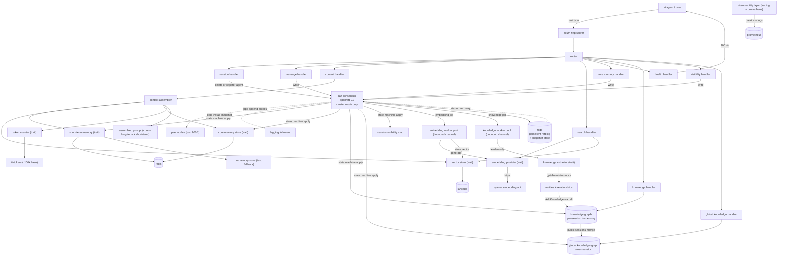
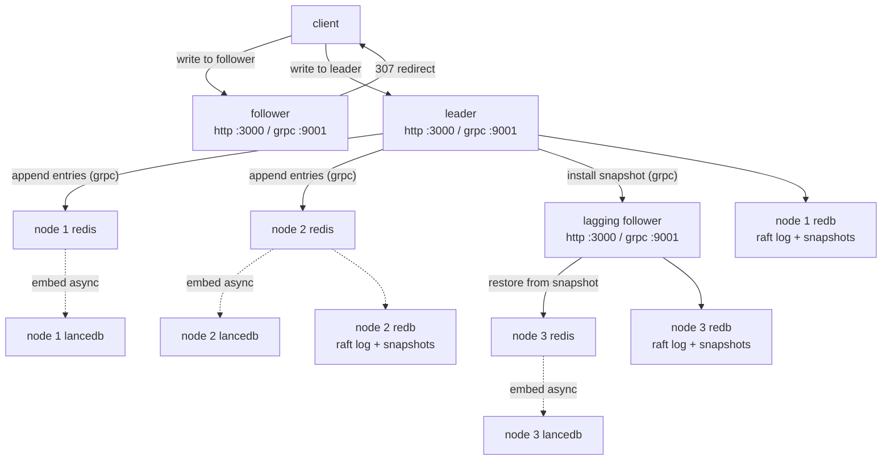

# Architecture

## Overview

Engram is an asynchronous semantic memory backend for LLM-powered agents, written in Rust. It provides short-term, long-term, and core memory for agents, enabling context assembly with strict token budgeting, semantic search, and transparent memory management.

All major components are behind trait abstractions so implementations can be swapped out and mocked in tests without changing any calling code.

## Data flow

In cluster mode, writes go through Raft consensus before reaching the stores. In standalone mode (NODE_ID not set), the Raft layer is absent and write handlers reach the stores directly.

Reads (context, search, knowledge queries) always go directly to the local stores on whichever node receives the request.

## Core abstractions (traits)

All major components are behind trait abstractions, which lets implementations be swapped out and mocked in tests without changing any calling code.

`EmbeddingProvider` generates text embeddings. In production this calls OpenAI; in tests it returns deterministic fixed vectors.

`VectorStore` handles long-term memory storage and semantic search. The production implementation is LanceDB.

`ShortTermMemory` manages recent message storage, count-based trimming, and embedding status tracking. Redis and in-memory implementations are both available.

`TokenCounter` counts tokens in text. The production implementation uses `tiktoken-rs` with `cl100k_base`.

`CoreMemoryStore` manages pinned session facts. Redis and in-memory implementations are both available.

`KnowledgeExtractor` extracts named entities and typed relationships from text. The `OpenAIKnowledgeExtractor` calls GPT-4o-mini with a structured JSON prompt and exponential backoff on 429s. `MockKnowledgeExtractor` uses pattern matching against a fixed set of relationship phrases; this is the default in Docker Compose and CI to avoid OpenAI quota consumption.

## Design decisions

| decision | alternatives | final choice & rationale |
|----------|-------------|-------------------------|
| bounded mpsc channel + worker pool for embedding | unbounded channel, inline embedding | bounded channel prevents memory blowup, and a fixed worker pool caps concurrent API calls while keeping request latency low |
| LanceDB over Milvus | Milvus, Pinecone, QDrant | LanceDB is embedded, zero-ops, Rust-native, easy to test and deploy |
| Redis for short-term/core memory | in-memory only, Postgres | Redis is fast, supports TTL, and is widely used for volatile state |
| pair-preserving trim in context assembler | naive trim, no trim | preserves dialogue integrity, prevents LLM hallucinations |
| idempotent embedding jobs | no idempotency | safe retries, prevents duplicate vectors on crash or retry |
| observability from day 1 | add later | tracing and Prometheus from the start for reliability and debugging |
| leader-only extraction for knowledge | all nodes extract | one LLM call per message vs N (one per node); non-determinism in extraction would cause divergent graphs across nodes |
| AddKnowledge routed through Raft | apply directly on leader | ensures all nodes receive the same extraction result; graph stays consistent without extra sync |
| knowledge graph snapshotted with full state | separate persistent store | keeps snapshot boundary clean; a single lock held across all `dump_all` calls guarantees the snapshot reflects exactly one `last_applied` index |
| MockKnowledgeExtractor as default in Docker Compose | always OpenAI | decouples cluster verification from OpenAI API quota; pattern-matching mock is deterministic and offline-capable |
| redb v2 for Raft log and snapshot store | sled, RocksDB, file-based log | redb is pure Rust, ACID, embedded, and simple to use; the key constraint is that tables must be pre-created in a write transaction before any read transaction touches them on a fresh database |
| Redis as a projection, not the source of truth | reconcile Redis with Raft log on recovery | flushing Redis unconditionally on startup and restoring from the snapshot avoids a maze of reconciliation edge cases; one authoritative source (Raft log plus latest snapshot) with all volatile state derived from it |
| global graph as in-memory projection of public sessions | separate global persistent store | the global graph is always derivable from the full log; snapshotting it avoids replaying the entire history on startup while keeping the system simple |
| session visibility defaults to Private | defaults to Shared | private by default prevents unintended cross-agent knowledge leakage; agents opt in explicitly |

## Context assembly algorithm

- allocate token budget: start with core memory (non-trimmable), then trim short-term messages to fit the remaining budget, then inject long-term memories if space remains
- derive query: use the most recent user message in trimmed short-term, else the last message, else empty
- perform semantic search: embed the query, search LanceDB, filter by similarity threshold, and take top-k
- format: each long-term memory as `Memory: {text}`
- assemble: core memory, long-term memories, then short-term messages

## Security and multi-tenancy

- current: no server-side authentication in the MVP; `OPENAI_API_KEY` is only used for outbound embedding requests
- future: API key authentication, multi-tenant support, and optional auth are planned for production

## Deployment architecture

Docker compose sets up:
- Redis: short-term and core memory
- app: Rust server, reads env vars from `.env`
- Prometheus: metrics scraping
- Grafana: dashboard (optional)

the application reads configuration from environment variables such as `REDIS_URL`, `OPENAI_API_KEY`, `LANCE_DB_PATH`, `SHORT_TERM_COUNT`, `EMBEDDING_MAX_CONCURRENCY`, `MPSC_CHANNEL_SIZE`, `RUST_LOG`, and `LOG_FORMAT`.

## Stage 2: Knowledge Formation

Stage 2 adds a knowledge graph pipeline that runs alongside the existing memory system. Every message that flows through the Raft state machine also produces a `KnowledgeJob` which is forwarded to a dedicated worker pool.

### Knowledge pipeline

1. State machine receives `AddMessage` command and enqueues `KnowledgeJob { session_id, message_id, text }` on a bounded channel (capacity 500 by default).
2. Knowledge workers dequeue jobs. In cluster mode only the current leader calls the extractor; followers skip because they will receive the result via Raft replication. This prevents duplicate LLM calls and avoids non-deterministic divergence between nodes.
3. The extractor calls GPT-4o-mini (or the mock) with a structured JSON prompt requesting named entities and typed relationships.
4. The result is submitted as a `MemoryCommand::AddKnowledge` through `raft.client_write()`. OpenRaft replicates this to all nodes.
5. Each node's state machine applies `AddKnowledge` to its local `KnowledgeGraph` (idempotent by `(session_id, message_id)` key).

In standalone mode (no `NODE_ID`) the worker applies the extraction result directly to the local graph without going through Raft.

### KnowledgeGraph internals

`KnowledgeGraph` is a per-session directed graph backed by [`petgraph`](https://docs.rs/petgraph). Each session has its own `DiGraph<EntityNode, RelEdge>` plus a `HashMap<String, NodeIndex>` for O(1) name lookups. Deduplication is tracked in a `HashSet<String>` keyed on `"session_id\x00message_id"`.

Key operations:
- `apply_extraction`: upserts entities and adds edges; returns `false` if the `(session_id, message_id)` pair was already processed.
- `get_related`: returns all neighbours (incoming and outgoing) for a named entity.
- `find_path`: BFS shortest path following outgoing edges only; returns a `Vec<PathEdge>` or `None`.
- `delete_session`: removes the session graph and all its dedup keys.

### Knowledge REST endpoints

| method | path | description |
|--------|------|-------------|
| GET | `/sessions/{id}/knowledge` | full graph: all entities and edges for the session |
| GET | `/sessions/{id}/knowledge/entities/{entity}` | all entities connected to the named entity (incoming + outgoing) |
| GET | `/sessions/{id}/knowledge/path?from=X&to=Y` | BFS shortest path between two named entities |
| GET | `/sessions/{id}/knowledge/export?format=json\|dot` | export the graph as JSON or Graphviz DOT |

### Knowledge metrics

Four Prometheus metrics are exposed alongside the existing Raft and embedding metrics:

| metric | type | description |
|--------|------|-------------|
| `engram_knowledge_extraction_duration_seconds` | histogram | wall-clock time per extraction call (label: `extractor`) |
| `engram_knowledge_entities_extracted_total` | counter | cumulative entities extracted |
| `engram_knowledge_relationships_extracted_total` | counter | cumulative relationships extracted |
| `engram_knowledge_queue_size` | gauge | pending jobs in the knowledge channel |

## Distributed cluster mode (Stage 1)

In cluster mode, multiple Engram nodes form a Raft consensus group using [OpenRaft 0.9](https://github.com/datafuselabs/openraft). Cluster mode is enabled by setting `NODE_ID` in the environment. Without it, the server runs in standalone mode exactly as described above.

### Node anatomy

Each cluster node runs two servers simultaneously:

- an Axum HTTP server (default port 3000) that handles client requests
- a tonic gRPC server (default port 9001) that handles Raft protocol messages (Vote, AppendEntries)

Each node also owns its own Redis instance and LanceDB database. There is no shared storage between nodes.

### Write path

In cluster mode, every write goes through Raft before a response is returned:

1. Client sends a write (add message, add fact, or delete session) to any node
2. If the receiving node is a follower, it returns HTTP 307 with a `Location` header pointing to the leader's HTTP address
3. If the receiving node is the leader, it calls `raft.client_write()` with a `MemoryCommand`
4. OpenRaft replicates the command to a quorum of nodes via gRPC AppendEntries
5. Each node's Raft state machine applies the committed command to its local Redis

The cluster also exposes management endpoints at `/cluster`, `/cluster/init`, `/cluster/add-learner`, and `/cluster/change-membership`.

### LanceDB consistency

LanceDB is per-node and eventually consistent. When a write is committed through Raft, each node's state machine enqueues an `EmbeddingJob`. Each node's background worker independently calls OpenAI and stores the result in its local LanceDB.

OpenAI text embeddings are deterministic for the same input. All nodes converge to identical vector state, with a timing lag proportional to embedding worker throughput. Semantic search results may be briefly stale on followers. This is a deliberate Stage 1 tradeoff: replicating 1536-float vectors through Raft on every write would be wasteful.

### Raft implementation

| component | description |
|-----------|-------------|
| `EngRaftLogStore` | redb-backed persistent log store; implements `RaftLogStorage + RaftLogReader`; pre-creates tables on init so read transactions never fail on a fresh database |
| `EngStateMachineStore` | applies committed `MemoryCommand` entries to Redis, the per-session knowledge graph, the global graph, and the session visibility map; hosts `EngSnapshotBuilder`, which serializes the full state to an `EngramSnapshot` payload and persists it in redb |
| `EngRaftNetwork` | factory that creates per-peer gRPC connections using tonic channels |
| `EngRaftNetworkConnection` | sends Vote, AppendEntries, and InstallSnapshot RPCs over gRPC; the snapshot payload is a serialized `EngramSnapshot` |
| `RaftGrpcServer` | tonic service that forwards incoming Raft RPCs to the local `RaftHandle`; handles `InstallSnapshotRequest` so lagging followers can restore a leader snapshot over gRPC |

`MemoryCommand` has six variants: `AddMessage`, `AddFact`, `DeleteSession`, `AddKnowledge`, `SetSessionVisibility`, and `RegisterSession`. `AddMessage` also enqueues a `KnowledgeJob` so every committed message is a candidate for knowledge extraction.

`EngramSnapshot` is the versioned payload serialized into every snapshot. It contains `short_term`, `core_memory`, `knowledge_graph`, `global_graph`, `visibility`, and `session_agents`. The `version: 1` field and `#[serde(default)]` on optional fields mean older nodes can install newer snapshots by ignoring fields they don't recognize.

`recover_state_machine()` in `src/raft/recovery.rs` runs at node startup before Raft is initialized. It flushes Redis, loads the latest persisted snapshot from redb, restores the payload into the live stores, and advances `last_applied` and `last_membership`. OpenRaft then replays any committed log entries that sit past the snapshot index.

### Prometheus metrics in cluster mode

Seven metrics are exported when a node is in cluster mode. Four cover the Raft consensus state, and three cover the snapshot subsystem:

| metric | type | description |
|--------|------|-------------|
| `engram_raft_term` | gauge | current Raft term |
| `engram_raft_commit_index` | gauge | index of the last applied log entry |
| `engram_raft_is_leader` | gauge | 1 if this node is the current leader, 0 otherwise |
| `engram_raft_leader_changes_total` | counter | number of leader changes observed by this node |
| `engram_snapshot_build_total` | counter | number of snapshots built by this node |
| `engram_snapshot_install_total` | counter | number of snapshots installed from the leader |
| `engram_snapshot_last_index` | gauge | log index of the most recent snapshot; 0 if no snapshot exists |

A background task watches the OpenRaft metrics channel and updates all seven gauges and counters on every change.

### Knowledge metrics (all modes)

Four additional metrics cover the knowledge extraction pipeline and are emitted in both standalone and cluster mode:

| metric | type | description |
|--------|------|-------------|
| `engram_knowledge_extraction_duration_seconds` | histogram | wall-clock time per extraction call |
| `engram_knowledge_entities_extracted_total` | counter | cumulative entities extracted |
| `engram_knowledge_relationships_extracted_total` | counter | cumulative relationships extracted |
| `engram_knowledge_queue_size` | gauge | pending jobs in the knowledge worker channel |

## Stage 3A: Persistence and recovery

Stage 3A replaced the in-memory Raft log store with a persistent redb-backed store, implemented full state machine snapshots, and added startup recovery. A cluster can now survive complete restarts without losing committed state, and lagging followers can catch up via snapshot install rather than requiring manual re-initialization.

### Snapshot architecture

The leader builds a snapshot by serializing the entire state machine under the `SmInner` lock. Holding the lock continuously across all `dump_all` calls (short-term memory, core memory, knowledge graph) guarantees that the snapshot represents exactly the state at `last_applied` index N rather than a mix of states from different moments.

Snapshots are stored in redb in the same database file as the Raft log (`RAFT_DB_PATH`). Log compaction runs automatically when the number of committed entries since the last snapshot exceeds `SNAPSHOT_LOG_THRESHOLD` (default 1000).

### Recovery sequence

At startup, before OpenRaft is initialized, `recover_state_machine()` runs:

1. Flush Redis completely. This is unconditional; Redis is always treated as a projection, never as a source of truth.
2. Load the latest `EngramSnapshot` from the redb snapshot table.
3. Restore `short_term`, `core_memory`, `knowledge_graph`, `global_graph`, `visibility`, and `session_agents` from the snapshot payload.
4. Set `last_applied` and `last_membership` so OpenRaft knows where the state machine is.
5. OpenRaft reads the persistent log and replays any committed entries past the snapshot index.

If no snapshot exists (fresh node), the flush still runs, and OpenRaft starts from index 0.

### InstallSnapshot

When a follower falls too far behind the leader's log, OpenRaft triggers the `InstallSnapshot` path. The leader serializes the current `EngramSnapshot`, sends it over gRPC via `send_install_snapshot`, and the follower's `RaftGrpcServer` handler restores the payload: flush Redis, restore stores, update `last_applied` and `last_membership`. The `loosen-follower-log-revert` openraft feature flag is required; without it, openraft panics when a snapshot install would revert a follower's log past entries from a previous term.

### Snapshot metrics

Three Prometheus metrics are exported in cluster mode alongside the existing Raft metrics:

| metric | type | description |
|--------|------|-------------|
| `engram_snapshot_build_total` | counter | number of snapshots built by this node |
| `engram_snapshot_install_total` | counter | number of snapshots installed (received from leader) |
| `engram_snapshot_last_index` | gauge | log index of the most recent snapshot; 0 if no snapshot exists |

`engram_snapshot_last_index` is updated from the OpenRaft `RaftMetrics.snapshot` field in the background metrics watcher task in `app.rs`.

## Stage 3B: Collective memory

Stage 3B adds cross-agent knowledge sharing. Multiple agents can now contribute to a shared global knowledge graph, control whether their sessions are public or private, and inspect conflicts between facts reported by different sessions.

### Session visibility

Each session has a visibility setting that defaults to `Private`. When set to `Shared`, the session's knowledge extraction results are merged into the global graph. The `SetSessionVisibility` Raft command replicates this change to all nodes so the visibility state stays consistent across the cluster.

`PUT /sessions/{session_id}/visibility` accepts `{ "visibility": "Shared" }` or `{ "visibility": "Private" }`. In standalone mode the command is accepted and no-ops (there is no global coordination needed when running a single node).

### Agent registration

`POST /sessions` now accepts an optional `agent_id` field in the request body. When provided, the server issues a `RegisterSession` Raft command that records the `(session_id, agent_id)` mapping in `SmInner.session_agents`. This mapping is included in snapshots and survives restarts. It lets you trace which agent produced which knowledge in the global graph.

### Global knowledge graph

`GlobalGraph` is an in-memory directed graph that aggregates entities and relationships from all sessions whose visibility is set to `Shared`. It also tracks provenance (which session contributed each entity) and detects conflicts (the same entity connected to another entity via different relationship types across sessions).

When the state machine applies `AddKnowledge` for a session that is visible, it calls `global_graph.merge_with_agent()`, which upserts entities and edges with provenance metadata. Conflicts are recorded when a new relationship type for the same entity pair differs from an existing one.

### Global REST endpoints

| method | path | description |
|--------|------|-------------|
| PUT | `/sessions/{id}/visibility` | set session visibility (Private or Shared) |
| GET | `/knowledge/global` | full global graph: all entities and edges |
| GET | `/knowledge/global/entities/{name}` | entities connected to the named entity in the global graph |
| GET | `/knowledge/global/entities/{name}/sources` | sessions that contributed this entity |
| GET | `/knowledge/global/path?from=X&to=Y` | BFS shortest path in the global graph |
| GET | `/knowledge/global/export?format=json\|dot` | export the global graph as JSON or Graphviz DOT |
| GET | `/knowledge/global/conflicts` | list conflicting relationship types across sessions |

All global read endpoints return data from the local in-memory `GlobalGraph`. In cluster mode the global graph is eventually consistent: a freshly committed `SetSessionVisibility` or `AddKnowledge` may not appear immediately on a follower that is slightly behind the leader.

### Global graph metrics

Three Prometheus gauges track the state of the global graph. They are updated each time the state machine applies a command that modifies the global graph:

| metric | type | description |
|--------|------|-------------|
| `engram_global_entities` | gauge | number of distinct entities in the global graph |
| `engram_global_relationships` | gauge | number of edges in the global graph |
| `engram_global_conflicts` | gauge | number of detected conflicting relationship types |

### Snapshot protocol v2

The `EngramSnapshot` payload now includes `global_graph`, `visibility`, and `session_agents` fields alongside the existing `short_term`, `core_memory`, and `knowledge_graph` fields. The `#[serde(default)]` attribute on all new fields means Stage 3A snapshots deserialize cleanly on Stage 3B nodes.

## Deferred items

The following remain out of scope after Stage 3B:

- **LanceDB replication.** Each node still calls the embedding API independently. Routing vector storage through Raft (leader-only embedding, follower payload replication) is a future item.
- **KG-augmented context assembly.** The knowledge graph (per-session and global) is queryable via REST but is not yet integrated into the context assembly pipeline to augment semantic search results.
- **Multi-tenant auth.** Cluster-aware authentication routing.
