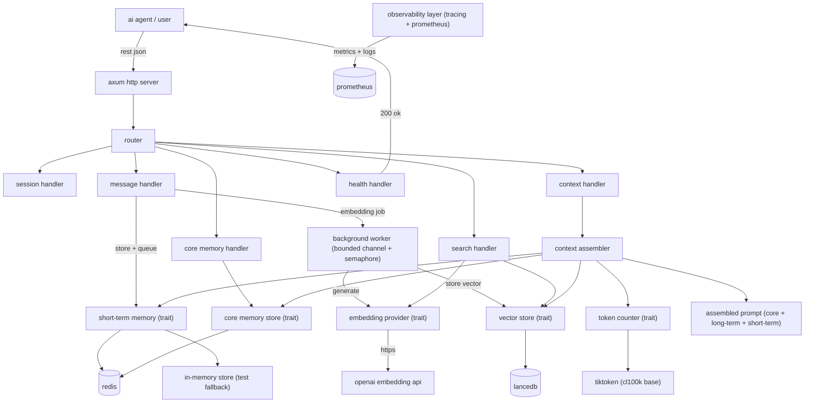

# architecture

## overview

engram is an asynchronous semantic memory backend for LLM-powered agents, written in Rust. it provides short-term, long-term, and core memory for agents, enabling context assembly with strict token budgeting, semantic search, and transparent memory management.

the system is designed for performance, reliability, and developer control, with all major components behind trait abstractions for easy swapping and testing.

## data flow

a message from a user or agent follows this path:
- arrives at a rest endpoint (e.g., `/sessions/{session_id}/messages`)
- stored in the short-term memory store (redis)
- enqueued as an `embeddingjob` on a bounded mpsc channel
- background worker picks up the job, calls the embedding provider (openai or dummy), and stores the resulting vector in lancedb
- when context is requested, the context assembler:
  - fetches core memory (pinned facts)
  - trims short-term messages to fit the token budget, preserving user-assistant pairs
  - derives a query from the most recent user message (or last message)
  - performs semantic search in lancedb for long-term memories above a similarity threshold
  - assembles the final prompt: core memory, long-term memories, then short-term messages

## core abstractions (traits)

- **embeddingprovider**: abstracts embedding generation (OpenAI, dummy). key method: `embed(&self, texts: &[string]) -> result<vec<vec<f32>>, embederror>`. enables swapping providers and mocking in tests.
- **vectorstore**: abstracts long-term memory storage and search (LanceDB, dummy). key methods: `insert`, `search`, `delete_session`. enables switching vector DBs and test isolation.
- **shorttermmemory**: abstracts short-term message storage (Redis, in-memory). key methods: `add_message`, `get_recent`, `trim`, `trim_to_token_budget`, `delete_session`. allows for fast, volatile storage and easy test mocking.
- **tokencounter**: abstracts token counting (tiktoken, dummy). key method: `count_tokens(&self, text: &str) -> usize`. enables accurate budgeting and testability.
- **corememorystore**: abstracts core memory (Redis, in-memory). key methods: `add_fact`, `get_facts`, `delete_session`. supports pinned facts and per-session isolation.

traits are used to enable dependency inversion, easy swapping of implementations, and comprehensive test mocking.

## design decisions

| decision | alternatives | final choice & rationale |
|----------|-------------|-------------------------|
| bounded mpsc channel + semaphore for embedding worker | unbounded channel, inline embedding | bounded channel prevents memory blowup, semaphore limits concurrent API calls, enables backpressure |
| LanceDB over Milvus | Milvus, Pinecone, QDrant | LanceDB is embedded, zero-ops, Rust-native, easy to test and deploy |
| Redis for short-term/core memory | in-memory only, Postgres | Redis is fast, supports TTL, and is widely used for volatile state |
| pair-preserving trim in context assembler | naive trim, no trim | preserves dialogue integrity, prevents LLM hallucinations |
| idempotent embedding jobs | no idempotency | safe retries, prevents duplicate vectors on crash or retry |
| observability from day 1 | add later | tracing and Prometheus from the start for reliability and debugging |

## context assembly algorithm

- allocate token budget: start with core memory (non-trimmable), then trim short-term messages to fit remaining budget, then inject long-term memories if space remains
- derive query: use most recent user message in trimmed short-term, else last message, else empty
- perform semantic search: embed query, search LanceDB, filter by similarity threshold, take top-k
- format: each long-term memory as `memory: {text}`
- assemble: core memory, long-term memories, short-term messages

## security and multi-tenancy

- current: no authentication in MVP, OpenAPI key required for embedding only
- future: API key authentication, multi-tenant support, and optional auth planned for production

## deployment architecture

Docker compose sets up:
- Redis: short-term and core memory
- app: Rust server, reads env vars from `.env`
- Prometheus: metrics scraping
- Grafana: dashboard (optional)

application reads configuration from environment variables (see readme/configuration section).