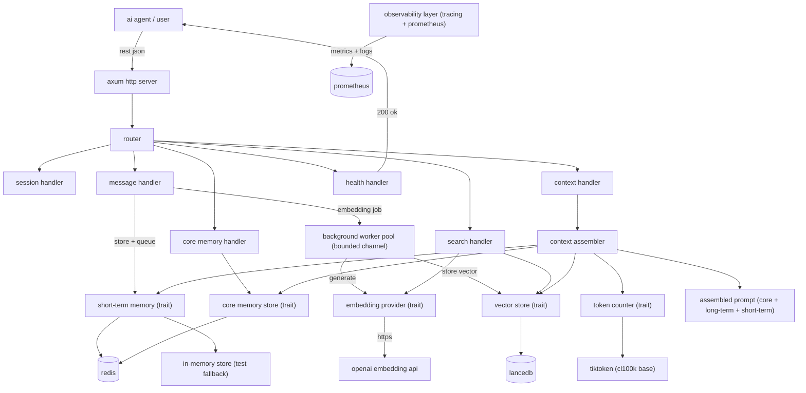

# Architecture

## Overview

engram is an asynchronous semantic memory backend for LLM-powered agents, written in Rust. It provides short-term, long-term, and core memory for agents, enabling context assembly with strict token budgeting, semantic search, and transparent memory management.

The system is designed for performance, reliability, and developer control, with all major components behind trait abstractions for easy swapping and testing.

## Data Flow

a message from a user or agent follows this path:
- arrives at a REST endpoint such as `/sessions/{session_id}/messages`
- is stored in the short-term memory store with an embedding status
- is enqueued as an `EmbeddingJob` on a bounded Tokio `mpsc` channel
- is picked up by one of the background workers, embedded, and persisted to LanceDB
- when context is requested, the context assembler:
  - fetches core memory facts
  - trims short-term messages to fit the token budget while preserving user-assistant pairs
  - derives a query from the most recent user message (or last message)
  - performs semantic search in LanceDB for long-term memories above a similarity threshold
  - assembles the final prompt as core memory, then long-term memories, then short-term messages

## Core Abstractions (Traits)

- **EmbeddingProvider**: abstracts embedding generation. Current implementations include OpenAI in production and deterministic mocks in tests.
- **VectorStore**: abstracts long-term memory storage and search. The primary production implementation is LanceDB.
- **ShortTermMemory**: abstracts recent message storage, trimming, and embedding status updates. Redis and in-memory implementations are both available.
- **TokenCounter**: abstracts token counting. The production implementation uses `tiktoken-rs` with `cl100k_base`.
- **CoreMemoryStore**: abstracts pinned session facts. Redis and in-memory implementations are both available.

Traits are used to enable dependency inversion, easy swapping of implementations, and comprehensive test mocking.

## Design Decisions

| decision | alternatives | final choice & rationale |
|----------|-------------|-------------------------|
| bounded mpsc channel + worker pool for embedding | unbounded channel, inline embedding | bounded channel prevents memory blowup, and a fixed worker pool caps concurrent API calls while keeping request latency low |
| LanceDB over Milvus | Milvus, Pinecone, QDrant | LanceDB is embedded, zero-ops, Rust-native, easy to test and deploy |
| Redis for short-term/core memory | in-memory only, Postgres | Redis is fast, supports TTL, and is widely used for volatile state |
| pair-preserving trim in context assembler | naive trim, no trim | preserves dialogue integrity, prevents LLM hallucinations |
| idempotent embedding jobs | no idempotency | safe retries, prevents duplicate vectors on crash or retry |
| observability from day 1 | add later | tracing and Prometheus from the start for reliability and debugging |

## Context Assembly Algorithm

- allocate token budget: start with core memory (non-trimmable), then trim short-term messages to fit the remaining budget, then inject long-term memories if space remains
- derive query: use the most recent user message in trimmed short-term, else the last message, else empty
- perform semantic search: embed the query, search LanceDB, filter by similarity threshold, and take top-k
- format: each long-term memory as `Memory: {text}`
- assemble: core memory, long-term memories, then short-term messages

## Security and Multi-Tenancy

- current: no server-side authentication in the MVP; `OPENAI_API_KEY` is only used for outbound embedding requests
- future: API key authentication, multi-tenant support, and optional auth are planned for production

## Deployment Architecture

Docker compose sets up:
- Redis: short-term and core memory
- app: Rust server, reads env vars from `.env`
- Prometheus: metrics scraping
- Grafana: dashboard (optional)

the application reads configuration from environment variables such as `REDIS_URL`, `OPENAI_API_KEY`, `LANCE_DB_PATH`, `SHORT_TERM_COUNT`, `EMBEDDING_MAX_CONCURRENCY`, `MPSC_CHANNEL_SIZE`, `RUST_LOG`, and `LOG_FORMAT`.