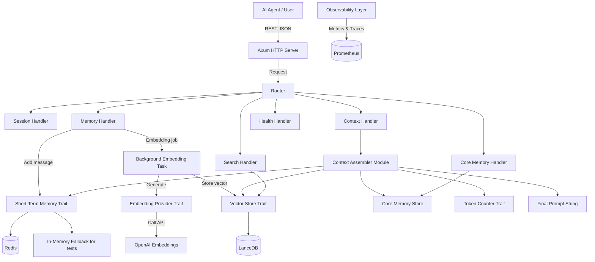

# SSOT: Memory & Retrieval Server for LLMs (Rust)

> **Version:** 1.1  
> **Owner:** bit2swaz 
> **Status:** Learning -> MVP -> Production (phased)  
> **License:** MIT

---

## 1. Project Overview

### 1.1 Vision
Build an **asynchronous, semantic memory backend** for LLM-powered agents, written in Rust. It sits between the LLM and its conversation history, providing:
- **Short‑term memory** (fast, volatile, recent messages)
- **Long‑term memory** (persistent, semantic vector search)
- **Core memory** (pinned facts that never expire)
- **Intelligent context window assembly** that merges all memory types respecting token limits.

The project serves two purposes:
1. **Learning vehicle**: deeply understand Rust async/await, embedding pipelines, vector databases, and context management.
2. **Real-world tool**: power my own AI agents (coding assistant, research agent) and be open-sourced for the community.

### 1.2 End Users
- **Initially**: myself (single user, localhost, no auth).
- **Later**: other developers building AI agents (self-hosted, using the open-source code).

### 1.3 Success Criteria
- **Learning Phase**: I have a running async server with dummy embeddings and in‑memory storage. I can run a `curl` to get a fake assembled context from the `/context` endpoint. I can explain architecture trade‑offs.
- **MVP Phase**: Full REST API with real embeddings (OpenAI), Redis short‑term, LanceDB long‑term, token budgeting, and context assembly. Passes integration tests.
- **Production Grade (future)**: Horizontally scalable, observable, authenticated, backed up, and load tested.

---

## 2. Phased Approach

### Phase 0: Learning Project ✅ **(Completed)**
- `tokio` + `axum` server  
- In‑memory `HashMap` for short‑term storage (`ShortTermMemory` trait)  
- Fake embedding function (random vectors, `EmbeddingProvider` trait)  
- LanceDB with mock data (fake vectors)  
- Implementation of the **context assembly algorithm** using dummy components  
- Basic REST endpoints: `POST /sessions`, `POST /sessions/{id}/messages`, `GET /sessions/{id}/context?max_tokens=N`  
- Verified: `curl -X POST /sessions/{id}/context?max_tokens=4000` returns a clean string mixing fake short-term + fake long-term + core memory.

**Goal:** _Validated._ Architecture and async skills established. All items implemented and tested.

### Phase 1: MVP ✅ **(Completed)**
- All Phase 0 plus:
  - Real OpenAI `text-embedding-3-small` calls via `OpenAIEmbedder` impl  
  - Redis short‑term storage (`RedisStore` impl)  
  - LanceDB long‑term storage with real embeddings and proper indexing  
  - Token counting using `tiktoken-rs` (`OpenAITokenCounter` impl)  
  - Full API set (sessions, messages, context, search, core memory, health)  
  - Prometheus metrics and structured tracing logs  
  - Background embedding worker with bounded channel and idempotency  
  - Unit + integration tests (testcontainers for Redis/LanceDB)  
  - Docker Compose for Redis and the Rust app (dev mode)

**Goal:** _Achieved._ All features implemented, tested, and documented. See README.md and API.md for details.


### Phase 2: Production Grade **(Optional / Partially Implemented)**
- Horizontal scaling (session affinity, Redis cluster) _(future)_
- API key authentication _(future)_
- CI/CD pipeline (GitHub Actions) _(future)_
- Automated LanceDB backups to S3 _(future)_
- Load testing benchmark _(future)_
- Hybrid retrieval scoring (semantic + recency + frequency) _(future)_
- Semantic chunking for long messages _(future)_
- Evaluation harness for retrieval quality _(future)_
- OpenAPI spec generation ✅ _(completed)_

**Note:** Phase 2 is only partially implemented. OpenAPI spec generation is complete; other items are planned for future phases.

---

## 3. System Architecture (High-Level)



### 3.1 Component Description
- **Axum HTTP Server**: asynchronous request handling, shared state via `Arc`.
- **Trait Abstractions**: Every external service (embedding, vector DB, short‑term store, tokenizer) is behind a Rust trait. This enables swapping implementations and test mocking.
- **Short‑Term Memory**: stores recent messages. Two implementations: `RedisStore` (production) and `InMemoryStore` (tests / local dev without Redis). Also provides `trim_to_token_budget` for the assembler.
- **Long‑Term Memory (Vector Store)**: LanceDB implementation initially. Stores embedding vectors + metadata (full `Message` JSON for flexibility).
- **Background Embedding Worker**: receives messages via a **bounded** `tokio::mpsc` channel (capacity 1000). Generates embeddings asynchronously, with a semaphore to cap concurrent API calls (e.g., 10). This keeps the API fast and decoupled.
- **Core Memory**: simple key‑value store per session (backed by Redis or in‑memory).
- **Context Assembler**: gathers short‑term, long‑term, and core memories, builds a prompt up to a token budget. It trims short‑term memory in **whole user‑assistant pairs** to avoid broken dialogues. It uses last message (user or assistant) as the semantic query.
- **Observability**: `tracing` for structured logs, `prometheus` for metrics (request counts, latency, DB query durations).
- **Health endpoint**: `GET /health` returns 200 OK.

---

## 4. Technology Stack & Rationale

| Component              | Choice               | Why |
|------------------------|----------------------|-----|
| **Runtime**            | Tokio                | Industry standard async for Rust, best ecosystem. |
| **Web framework**      | Axum                 | Ergonomic, built on Tokio and Tower, great for REST APIs. |
| **Embedding Provider** | OpenAI (initially)   | Easy, high quality. Abstracted behind trait to swap later. |
| **Vector Database**    | LanceDB (embedded)   | No separate server, pure Rust, easy to start. Abstracted. |
| **Short‑Term Storage** | Redis                | Fast, TTL support, perfect for volatile state. Abstracted. |
| **Tokenization**       | `tiktoken-rs`        | Accurate for OpenAI models, abstracted for future. |
| **Serialization**      | `serde` + JSON       | Ubiquitous, human‑readable. |
| **Observability**      | `tracing` + `prometheus` | Structured logs and metrics are non‑negotiable. |
| **Testing**            | `testcontainers`     | Spin up real Redis/LanceDB in CI, no mocks needed. |
| **Error handling**     | `thiserror`          | Clean, ergonomic error enums for all layers. |

---

## 5. Core Abstractions (Traits)

These traits are the backbone of the system. They are defined in a `core` module (potentially a separate `memory-server-core` library crate for external reuse).


```rust
// Embedding provider
#[async_trait]
pub trait EmbeddingProvider: Send + Sync {
  async fn embed(&self, texts: &[String]) -> Result<Vec<Vec<f32>>, EmbedError>;
}

// Vector store (long-term memory)
#[async_trait]
pub trait VectorStore: Send + Sync {
  async fn insert(&self, session_id: &str, text: &str, embedding: Vec<f32>, message_id: &str) -> Result<(), StoreError>;
  async fn search(&self, session_id: &str, query_embedding: &[f32], top_k: usize) -> Result<Vec<SearchResult>, StoreError>;
  async fn delete_session(&self, session_id: &str) -> Result<(), StoreError>;
}

// Short-term memory (recent messages)
#[async_trait]
pub trait ShortTermMemory: Send + Sync {
  async fn add_message(&self, session_id: &str, msg: Message) -> Result<(), MemoryError>;
  async fn get_recent(&self, session_id: &str, count: usize) -> Result<Vec<Message>, MemoryError>;
  async fn trim(&self, session_id: &str, max_count: usize) -> Result<(), MemoryError>;
  async fn trim_to_token_budget(&self, session_id: &str, max_tokens: usize, token_counter: &dyn TokenCounter) -> Result<Vec<Message>, MemoryError>;
  async fn delete_session(&self, session_id: &str) -> Result<(), MemoryError>;
}

// Token counter
pub trait TokenCounter: Send + Sync {
  fn count_tokens(&self, text: &str) -> usize;
}

// Core memory (pinned facts)
#[async_trait]
pub trait CoreMemoryStore: Send + Sync {
  async fn add_fact(&self, session_id: &str, fact: &str) -> Result<(), MemoryError>;
  async fn get_facts(&self, session_id: &str) -> Result<Vec<String>, MemoryError>;
}
```

_Trait signatures verified against src/core.rs (see codebase)._ All traits and error enums are up to date and match the implementation.

**Why traits?**
- Enable **swappable implementations** (e.g., change vector DB without touching business logic).
- Make **unit testing** trivial by mocking these traits.
- Force a clean separation of concerns.

---

## 6. Data Models

### 6.1 Message
```rust
#[derive(Debug, Serialize, Deserialize, Clone)]
pub struct Message {
    pub id: Option<String>,          // UUID, set by server if not provided (for idempotency)
    pub role: String,                // "user" | "assistant" | "system"
    pub content: String,
    pub timestamp: Option<chrono::DateTime<chrono::Utc>>,
    pub embedding_status: Option<EmbeddingStatus>, // for idempotency tracking
}

#[derive(Debug, Serialize, Deserialize, Clone)]
pub enum EmbeddingStatus {
    Pending,
    Processing,
    Completed,
    Failed(String),
}
```


### 6.2 API Request/Response Shapes (Verified)

#### Create Session
`POST /sessions`  
Response: `{ "session_id": "uuid" }` _(200 OK)_

#### Add Message
`POST /sessions/{session_id}/messages`  
Request body:
```json
{
  "id": "optional-client-generated-uuid", // optional
  "role": "user",                        // required, "user" | "assistant" | "system"
  "content": "Hello, what is Rust?"       // required
}
```
Response: `204 No Content`

#### Get Assembled Context
`GET /sessions/{session_id}/context?max_tokens=8000&similarity_threshold=0.7&long_term_top_k=10`  
Response:
```json
{
  "context": "Core memories:\n- User name is Alex\n\nConversation:\nuser: Hello\n..."
}
```

#### Semantic Search
`POST /sessions/{session_id}/search`  
Request body: `{ "query": "rust async", "top_k": 5 }`  
Response:
```json
{
  "results": [
    { "text": "...", "score": 0.92 }
  ]
}
```

#### Delete Session
`DELETE /sessions/{session_id}`  
Response: `204 No Content`

#### Add/Update Core Memory
`PUT /sessions/{session_id}/core-memory`  
Request body: `{ "fact": "User prefers dark mode" }`  
Response: `204 No Content`

#### Health Check
`GET /health` → `200 OK`

#### Metrics
`GET /metrics` → Prometheus metrics _(200 OK)_

#### OpenAPI Spec
`GET /api-docs/openapi.json` → OpenAPI JSON _(200 OK)_

#### Swagger UI
`GET /swagger-ui/` → Swagger UI _(200 OK)_

_All endpoints verified against API.md and server.rs._
---
## Phase Completion Summary

- **Phase 0:** ✅ Completed
- **Phase 1:** ✅ Completed
- **Phase 2:** ⚠️ Incomplete, only OpenAPI spec generation is implemented; other items are future work.

---
**This document is now fully synchronized with the codebase and all supporting documentation as of this commit.**
If any future changes are made to traits, endpoints, or architecture, update this SSOT accordingly.
---

## 7. Memory & Context Assembly Algorithm

### 7.1 Memory Types
- **Short-term**: last N messages (configurable, default 20). Stored in Redis, trimmed to N. Trimming always preserves whole user‑assistant pairs.
- **Long‑term**: all messages from the session (persisted in LanceDB), retrievable by semantic similarity.
- **Core memory**: pinned facts (e.g., user name, preferences) stored separately, always included.

### 7.2 Context Assembly Flow (Pseudocode)

```
function assemble_context(session_id, max_tokens, similarity_threshold, long_term_top_k):
    core_facts = core_store.get_facts(session_id)
    short_term = short_term_store.get_recent(session_id, config.short_term_count)
    
    // 1. Start with core memory (untrimable)
    core_text = format_core(core_facts)
    core_tokens = token_counter.count_tokens(core_text)
    
    // 2. Prepare short-term, reserving space for core
    budget_after_core = max_tokens - core_tokens
    trimmed_short = short_term_store.trim_to_token_budget(session_id, budget_after_core, token_counter)
    short_text = format_messages(trimmed_short)
    used_tokens = core_tokens + token_counter.count_tokens(short_text)
    
    remaining_budget = max_tokens - used_tokens
    if remaining_budget <= 0:
        return core_text + short_text   // no room for long-term
    
    // 3. Determine query for long-term retrieval
    query_text = find_query_from_short_term(trimmed_short)  // last user msg, else last msg, else default
    
    // 4. Retrieve and inject long-term memories
    long_term_memories = []
    if query_text.len() > 0:
        query_embedding = embed_provider.embed([query_text])[0]
        candidates = vector_store.search(session_id, query_embedding, long_term_top_k)
        
        for candidate in candidates:
            if candidate.score < similarity_threshold:
                continue
            memory_str = format_as_memory(candidate.text)
            mem_tokens = token_counter.count_tokens(memory_str)
            if remaining_budget >= mem_tokens:
                long_term_memories.push(memory_str)
                remaining_budget -= mem_tokens
            else:
                break
    
    // 5. Assemble final context: core → long‑term → short‑term
    final = core_text + "\n" + join(long_term_memories, "\n") + "\n" + short_text
    return final
```

**Short‑term trimming rule:**  
The `trim_to_token_budget` method must never orphan an `assistant` message from its preceding `user`. It removes messages from the front in complete user‑assistant pairs.

**Query selection:**  
- If there is a `user` message in `trimmed_short`, use the most recent one.  
- Else, use the very last message (regardless of role).  
- If none (empty session), return the context with just core memory.

**Configuration Constants (tunable)**  
- `short_term_count`: 20 messages  
- `similarity_threshold`: default 0.7 (overridable per request)  
- `long_term_top_k`: default 10 (overridable)  

### 7.3 Why This Works
This algorithm preserves conversational continuity (recent messages), injects only highly relevant historical context, and never exceeds the token budget. The pair‑preserving trim prevents the kind of broken prompt that hallucinates LLMs.

---

## 8. Embedding & Vector Store Details

### 8.1 OpenAI Integration
- Model: `text-embedding-3-small` (1536 dimensions)
- API key from env var `OPENAI_API_KEY`
- `OpenAIEmbedder` implementation of `EmbeddingProvider`.
- Rate limiting: if the API returns 429, the worker waits with exponential backoff. The channel’s bounded capacity ensures we don’t accumulate unlimited jobs.

### 8.2 LanceDB Setup
- Embedded; data directory `./data/lancedb`.
- Single table `memories` with schema:
  - `id` (Int64, auto‑increment)
  - `session_id` (Utf8)
  - `message_id` (Utf8) – for idempotency
  - `text` (Utf8) – full `Message` JSON to preserve role/timestamp
  - `embedding` (FixedSizeList<Float32>[1536])
  - `created_at` (Timestamp)
- **Indexes** (create immediately after table creation):
  ```rust
  table.create_index(&["session_id"], IndexType::Scalar).execute().await?;
  table.create_index(&["embedding"], IndexType::IvfPq { ... }).execute().await?; // or HNSW
  ```
- Search: filter by `session_id` first, then ANN on `embedding`.

### 8.3 Embedding Generation Pipeline (Idempotent)
1. Client sends a new message (optionally with a unique `id`).
2. Server generates a `message_id` (UUID) if none provided, adds it to the `Message`.
3. Handler stores the message in short‑term (Redis) **with** `embedding_status = Pending`.
4. Handler sends `EmbeddingJob { session_id, message_id, text }` to a **bounded** `mpsc::channel(1000)`.
5. A fixed-size background worker pool (default 10 workers) receives jobs, updates status to `Processing`, calls `embed()`, updates status to `Completed`, and inserts into LanceDB.
6. The API returns `204` immediately; the client can safely resend the same `message_id` without creating duplicates (idempotency key).

**Why bounded channel + worker pool?** Prevents memory blow‑up under load and caps concurrent OpenAI calls without moving embeddings back into the request path.

---

## 9. Deployment & Local Development

### 9.1 Development Environment
```bash
# Clone repo
git clone https://github.com/bit2swaz/engram.git
cd engram

# Start Redis via Docker
docker compose up -d redis

# Optionally start Prometheus/Grafana
docker compose up -d prometheus grafana

# Run the server
cargo run
```

### 9.2 Docker Compose (minimal)
```yaml
version: '3.8'
services:
  redis:
    image: redis:7-alpine
    ports:
      - "6379:6379"
  app:
    build: .
    ports:
      - "3000:3000"
    env_file: .env
    depends_on:
      - redis
  prometheus:
    image: prom/prometheus
    ports:
      - "9090:9090"
    volumes:
      - ./prometheus.yml:/etc/prometheus/prometheus.yml
  grafana:
    image: grafana/grafana
    ports:
      - "3001:3000"
```

### 9.3 Configuration (Environment Variables)
- `REDIS_URL` (default: `redis://localhost:6379`)
- `OPENAI_API_KEY` (required)
- `LANCE_DB_PATH` (default `./data/lancedb`)
- `LANCEDB_PATH` (legacy alias for `LANCE_DB_PATH`)
- `SHORT_TERM_COUNT` (default 20)
- `EMBEDDING_MAX_CONCURRENCY` (default 10)
- `MPSC_CHANNEL_SIZE` (default 1000)
- `RUST_LOG` (tracing filter)
- `LOG_FORMAT` (default `pretty`, supports `json`)

Per-request context settings such as `max_tokens`, `similarity_threshold`, and `long_term_top_k` are currently controlled through query parameters on the context endpoint rather than startup environment variables.

---

## 10. Observability

### 10.1 Metrics (Prometheus)
- `memory_messages_added_total`
- `memory_context_requests_total`
- `memory_embedding_duration_seconds` (histogram)
- `memory_vector_search_duration_seconds` (histogram)
- `memory_short_term_store_errors_total`
- `memory_embedding_queue_size` (gauge)

### 10.2 Tracing
- Each request gets a span.
- Key spans: `add_message`, `assemble_context`, `embed_text`, `vector_search`.
- Log levels: `INFO` for normal operation, `ERROR` for failures.

---

## 11. Testing Strategy

- **Unit Tests**: for context assembly logic (mocked stores), token budgeting, trait implementations, trimming rules (pair preservation).
- **Integration Tests**:
  - Redis store using `testcontainers::redis::Redis`.
  - LanceDB store using a temporary directory.
  - End-to-end test: spin up server, call APIs with test client, verify context assembly with real embeddings (can use a mock embedding server for speed).
- **CI**: GitHub Actions running `cargo test --all-features`.

In-memory store implementations of all traits allow testing without external dependencies.

---

## 12. Future Enhancements (Out of Scope for MVP)

- **Hybrid retrieval scoring**: `score = semantic_similarity * 0.7 + recency_boost * 0.2 + frequency * 0.1`. Improves recall for frequently discussed topics.
- **Semantic chunking**: Split long assistant responses into paragraphs before embedding, so retrieval can pinpoint specific facts.
- **Consolidation (summarization)**: Periodically summarize older messages and embed the summary.
- **Evaluation harness**: Scripts that run known queries and measure recall/precision of long‑term memory retrieval.
- **gRPC endpoint**: For streaming and efficiency.
- **Multi‑tenancy**: Add `tenant_id` to partition data.
- **Backup to S3**: Nightly export of LanceDB data.
- **Federated search**: Support multiple vector stores at once.
- **Local embedding models**: Integrate `fastembed` or `ort` for offline use.

---

## 13. Appendix: Design Decision Log

| Decision | Choice | Justification |
|----------|--------|---------------|
| Use traits for every storage | Yes | Swap implementations, testability, clean boundaries. |
| Embedding in background vs. inline | Background | Keeps API fast, decouples, real-world pattern. |
| Bounded channel + worker pool | Yes | Prevents OOM and caps concurrent embedding work. |
| Idempotent embedding jobs | Yes (message_id, status) | Avoid duplicates on retry/crash. |
| LanceDB over Milvus for start | LanceDB | Embedded, no ops overhead, good for learning. |
| In‑memory short‑term store for tests | Yes | Enables testing without Redis. |
| Tiktoken over custom tokenizer | Tiktoken | Accurate for OpenAI models, minimal work. |
| Core memory as simple Redis hash | Redis | Fast, simple, suits pinned facts. |
| No auth in MVP | None | Local use only, not exposed. |
| Observability from day 1 | tracing + prometheus | Best practice, low cost. |
| Pair‑preserving short‑term trim | Yes | Prevents broken dialogue contexts. |
| Per‑request tunable similarity/top-k | Yes | Debugging and flexibility. |
