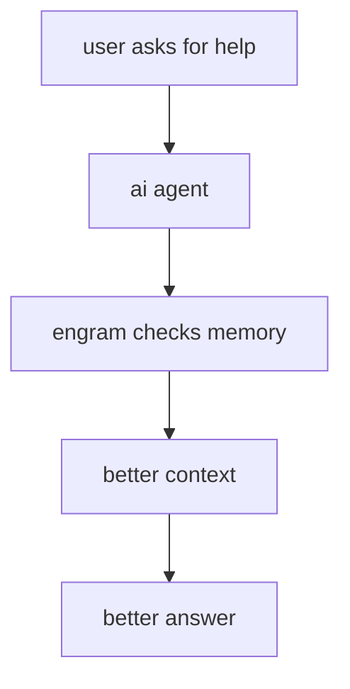
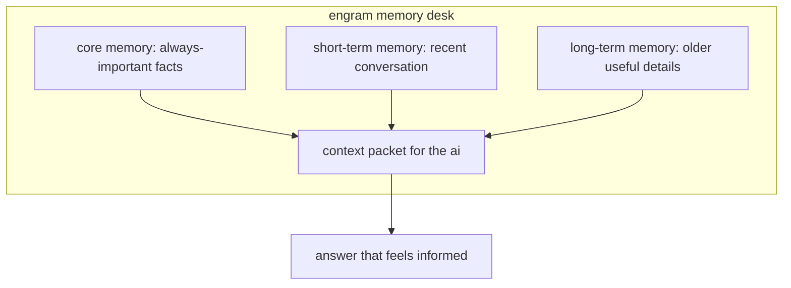

# engram: the memory desk behind smarter ai agents

> **if you only remember one thing about engram, make it this:**
> engram gives ai agents a memory system that feels less like a messy pile of sticky notes and more like a calm and well-run front desk.

engram is a self-hosted memory backend for ai agents, built in rust. but the *real* point of the project is not the language choice or the infra checklist. the point is that ai agents are often impressive at talking and absurdly weak at *remembering*.

they can sound confident. they can sound thoughtful. they can even sound personal.

and then, ten minutes later, they forget the most important thing you told them.

that is the problem engram is built to solve.

## what engram actually is

imagine an ai agent as the person at the front desk of a busy office.

people walk up, ask questions, mention preferences, give instructions, and expect that front desk person to remember what matters. if the front desk is disorganized, everything feels broken. the same questions get asked twice. important details disappear. urgent information gets buried under trivia.

engram is the proper system behind that desk.

it is the organized notebook, the filing cabinet, the pinned reminders, and the retrieval habit that lets the front desk person say, *"yes, i remember, and here is the part that matters right now."*

in other words, engram is not just more storage. it is **memory with priorities**.

that is the whole job.

not to make ai look magical.

not to throw the entire chat history back into the prompt.

not to pretend that forgetting is fine.

instead, the job is to help the agent remember the *right* things at the *right* time.

## why i built it

most ai memory systems feel like black boxes.

you put information in. you ask for context later. *something* comes back. maybe it works. maybe it does not. maybe it included the most important fact. maybe it dropped it. maybe it wasted half the prompt budget on irrelevant old chat.

i read about this, and that just never felt good enough to me.

i wanted a memory system i could actually understand from end to end. something self-hosted, explicit, inspectable, and fast enough to sit directly in the path between the user and the answer.

that matters because memory is not a side feature for ai agents. it changes the entire experience.

without memory, an agent can feel like a charming stranger.

with good memory, it starts to feel like a competent assistant.

that difference is ENORMOUS.

## why ai needs a memory system in the first place

people sometimes imagine ai memory as a giant brain that naturally stores everything. in practice though, it is much closer to a desk with limited space.

every time you send a prompt to a model, you are packing that desk with more and more information.

if you keep shoving the entire conversation into it, three bad things happen:

- **it gets expensive** because you are sending more tokens than necessary
- **it gets slower** because the model has to read more than it should
- **it gets worse** because the important detail is buried inside a wall of filler

that is why the naive approach, which is basically *"just dump the whole chat into the prompt again"*, is not smart. it's easy, yes, but easy is not the same as good.

engram takes the opposite approach.

instead of keeping everything in the room, it asks: **what belongs on the desk right now?**

## how engram works, in plain english

engram organizes memory into three kinds.

**short-term memory** is the stack of papers currently on the desk. it covers the recent back-and-forth, the fresh instructions, and the latest turn of the conversation.

**core memory** is the note taped to the monitor. these are the things that should stay important all the time, like stable preferences, rules, or facts the assistant should not casually forget.

**long-term memory** is the filing cabinet in the back office. it holds older material that may become relevant later, even if it does not need to stay in front of the model at every moment.

when a new message comes in, engram stores it immediately and handles the deeper indexing work in the background. that is important because a good office does not make everyone stand around waiting while someone files paperwork. the conversation keeps moving while the system quietly gets smarter behind the scenes.

later, when the agent needs context, engram assembles a clean packet.

first, it includes the always-important facts.

then it includes the recent conversation.

then, *only if there is room*, it pulls in older relevant memories.

that order is the difference between a packed carry-on and a junk drawer.

## why this is better than a giant chat dump

the simplest way to understand engram's value is to compare it to the alternative.

a giant chat dump says, *"i do not know what matters, so here is everything."*

engram says, **"i know space is limited, so i will choose carefully."**

that choice is the whole game.

one detail i personally like is that engram preserves conversational pairs. if a user asks a question and the assistant answers it, those two belong together. splitting them apart is like saving only one half of a phone call. technically, yeah, you stored *some* words.  but realistically, you lost the meaning.

engram avoids that.

it also tracks token budgets explicitly.
for the non-technical readers, think of this like packing a suitcase with a strict airline limit. you do not keep tossing things in and hope it works out. you weigh what matters, put the essentials in first, and stop before the bag becomes useless.

that is what engram does for ai context.

## why it feels trustworthy

one thing i realized building engram is that for memory infra, trust matters just as much as raw capability does.

engram is strong because it is designed to be **inspectable**.

you can understand the route a message takes.

you can understand why one kind of memory is treated differently from another.

you can understand why a specific piece of context was pulled into the final packet.

that may sound small, but it is not. if an agent gives a bad answer, teams need to know whether the issue came from the model, the retrieval logic, the budget, or the stored memory itself. engram makes those questions answerable.

it also feels solid because it is built like real infrastructure, not just another toy project which you vibecode on a weekend. it has docker support, metrics through prometheus, an openapi surface, background workers, and ci. in simple terms, that means the project is not just *interesting*. it is **runnable**, **observable**, and **operable**.

## why it is fast

speed matters because memory sits right in the path between the user's question and the agent's answer. if memory is slow, the whole experience feels slow.

engram performs well because it does not treat every request like moving an entire house. it behaves more like grabbing the correct folder from a labeled shelf.

the benchmark story is strong.

- **in-memory context assembly** was about 50 microseconds for 10 messages, 281 microseconds for 100 messages, 2.5 milliseconds for 1000 messages, and 13.4 milliseconds even with 5000 long-term entries involved.
- **real-store context assembly** stayed around 21 milliseconds for 10 messages, 22 milliseconds for 100 messages, and 30 milliseconds for 1000 messages.
- **end-to-end throughput** reached 64,500 messages per second.
- **token usage** was roughly 40 percent lower than a naive full-history approach at a 4k token budget.

for the non-technical audience, the meaning is simple: engram does not make the ai stop and rummage through the attic every time you ask a question. it gives the ai a neat and tidy workspace and a good filing habit.

## why the quality side matters just as much as speed

a fast memory system that retrieves the wrong thing is like a waiter who dashes off to your table with someone else's order. speed alone will never cut it.

that is why engram does not stop at performance claims. it also includes retrieval-quality benchmark harnesses for **longmemeval** and **beam**.

the first published longmemeval retrieval slice was small, just 5 evaluated questions using a local embedding model, so it should not be oversold. but it is still a meaningful early signal.

that run achieved:

- **recall@5: 1.0**
- **recall@10: 1.0**
- **mrr: 0.767**
- **ndcg@10: 0.826**
- **abstentions: 0**

in normal language, that means engram was already doing a strong job of finding the right memory in this first published benchmark slice.

the full 500-question run is still the bigger milestone. but the important thing is already true: engram is not only fast at assembling context. it is showing that the retrieval pipeline works on real benchmark-shaped data.

## why engram is good

the strongest thing about engram is also the most obvious thing for any project, and it is that the whole system feels orderly.

**ai memory is usually messy. engram makes it structured.**

**ai context is usually bloated. engram makes it selective.**

**ai retrieval is often hard to explain. engram makes it inspectable.**

many projects try to be everything at once: framework, platform, orchestration layer, product surface, and memory system all bundled together. engram is better because it stays focused. it is trying to do one important job well: give ai agents memory that is *clear, fast, and dependable*.

that focus is a strength.

it means fewer hidden surprises.

it means easier self-hosting.

it means easier reasoning.

it means easier testing.

it means a stronger foundation for anything you build on top.

### a quick comparison

if you want the shortest possible version of where engram sits next to the other well-known tools, it is this:

| tool | what it feels like | where it shines | where engram differs |
| --- | --- | --- |
| **mem0** | a popular memory add-on in the python world | convenient, familiar, broad ecosystem fit | engram leans harder into transparency, explicit context assembly, and self-hosting clarity |
| **zep** | a more full-platform memory system | richer retrieval options and a stronger published benchmark story today | engram is simpler to reason about, easier to inspect, and built around exact context visibility |
| **langchain memory** | a flexible memory layer inside a larger framework | useful if you already live inside langchain | engram is more opinionated, more observable, and less chain-dependent |
| **hindsight** | a more research-heavy memory approach | strongest public longmemeval-style score in our comparison and a knowledge-graph angle | engram trades some of that sophistication for simplicity, speed, and a cleaner deployment story |
| **engram** | **a calm, well-run front desk** | **fast context assembly, explicit token control, prompt visibility, and self-hosted simplicity** | **it is built to be inspectable from end to end, not magical from a distance** |

*the numbers in the comparison doc are still the source of truth. the short version is that zep and hindsight currently have the stronger public scorecards, mem0 is a familiar python-first choice, langchain memory is flexible but less standardized, and engram stands out most on transparency, speed, and operational simplicity.*

## the bigger idea behind the project

the deeper point of engram is that memory should not feel magical.

it should feel **reliable**.

when humans trust a great assistant, it is rarely because the assistant seems mystical. it is because the assistant is organized. they remember the right things. they keep priorities straight. they can explain how they found what they found.

that is exactly the kind of memory system ai needs as it moves from prototypes into actual products.

engram takes that idea seriously. it turns memory from a vague promise into a visible system. it gives ai a better way to remember, and it gives humans a better way to trust what the ai is doing.

**that is what engram does.**

**and that is why i built it.**

**and that is why it is good.**

---

*repo:* github.com/bit2swaz/engram